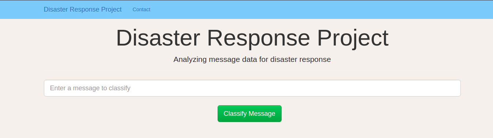
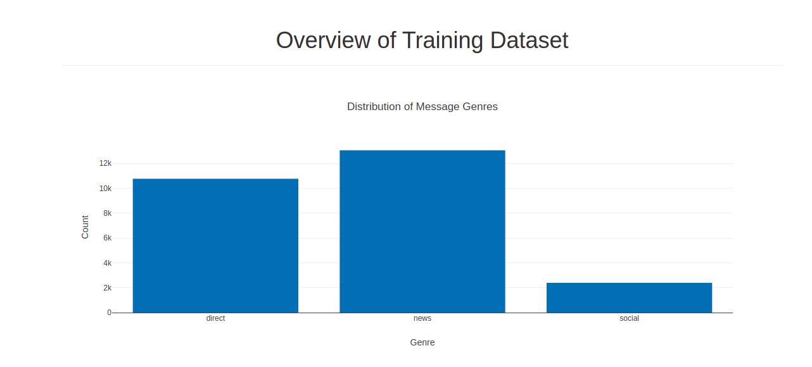
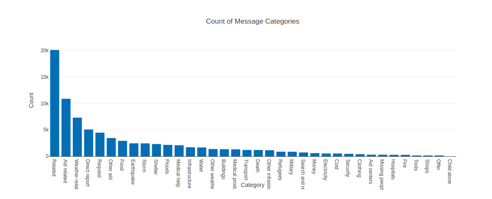
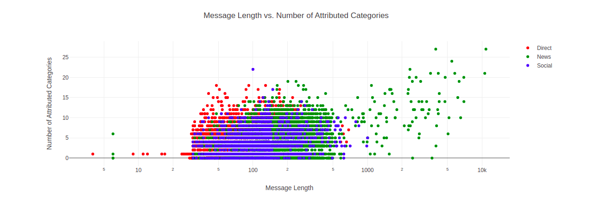
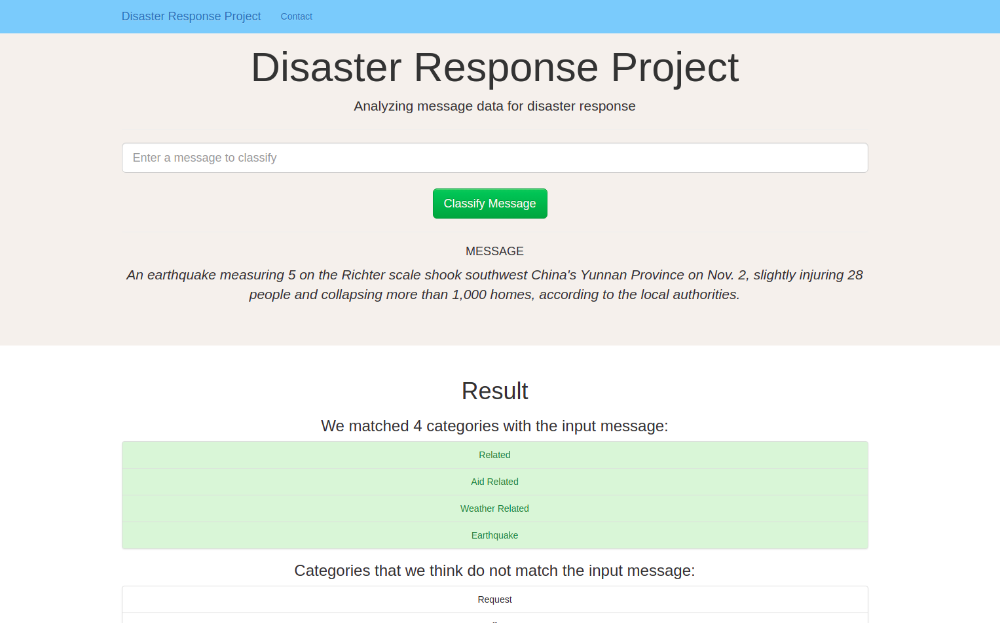

# Disaster Response Project
## A project of the Udacity Data Science Nanodegree

## Overview
The goal of the project was to implement a fully functional web app in which a user
can input a message related to a catastrophic disaster (e.g. earthquake, flood, fire,...)
and would receive a list of potential categories which describe the content of the
message. The classification output is based on a machine learning model trained with
social media messages using natural language processing (NLP).

The project covers the fundamental steps of a machine learning project:
- Loading raw data
- Cleaning data
- Storing cleaned data
- Training & evaluating a machine learning model
- Storing the ML-model
- Building a web app to make use of the ML-model and providing a service to users

## Project Structure
The project structure is made up of three main folders:
- app: Contains code related to the web app
- data: Contains the raw data files (.csv) and a script for data cleaning
- model: Contains a script to train and evaluate the machine learning model

## How to Run
To get started with the project run the following commands from the root directory:
1. `python3 ./data/process_data.py ./data/disaster_messages.csv ./data/disaster_categories.csv ./data/DisasterResponse.db`
2. `python3 ./models/train_classifier.py ./data/DisasterResponse.db ./models/disaster_response_model.pkl`
3. `python3 ./app/run.py`

Go to http://0.0.0.0:3001

Notes: You need to be within a Python virtual environment.

## Screenshots

## Acknowledgement
Special thanks to Figure Eight (acquired by [Appen](https://appen.com/)) for providing the curated dataset.